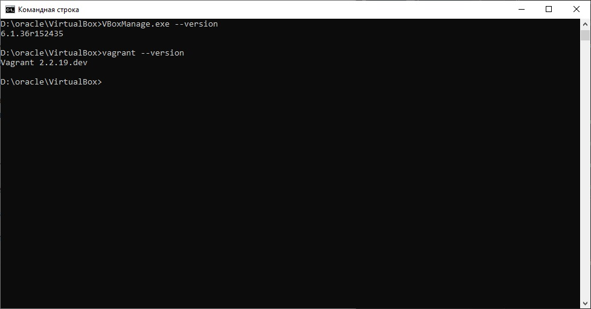
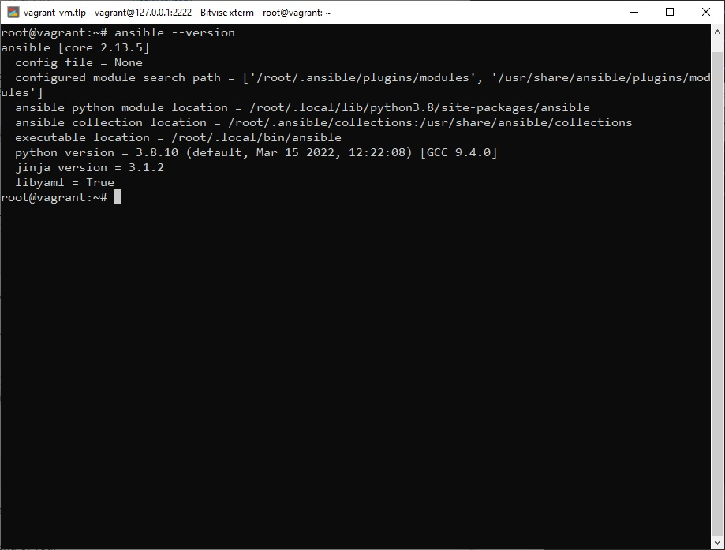

## Задача 1

- Опишите своими словами основные преимущества применения на практике IaaC паттернов.
```
Написав один раз рабочий скрипт, в последствии позволяет просто, быстро и автоматизированно разворачивать идентичные среды.
```
- Какой из принципов IaaC является основополагающим?
```
идемпотентность
```

## Задача 2

- Чем Ansible выгодно отличается от других систем управление конфигурациями?
```
Ansible не требует наличия агента на клиенте
```
- Какой, на ваш взгляд, метод работы систем конфигурации более надёжный push или pull?
```
Если рассматривать вопрос именно в контексте надежности, то считаю гибридный метод самым надежным и гибким. 
В случае необходимости срочного обновление используем push, для плановых обновлений pull. 
Если выбирать какой-то один, то определенно это будет push, так как позволит самостоятельно упралять процессом обновления.
```

## Задача 3

Установить на личный компьютер:

- VirtualBox
- Vagrant
- Ansible

*Приложить вывод команд установленных версий каждой из программ, оформленный в markdown.*

VM и Vagrant стоит на личной машине


Ansible поставил на виртуалку с ubuntu

