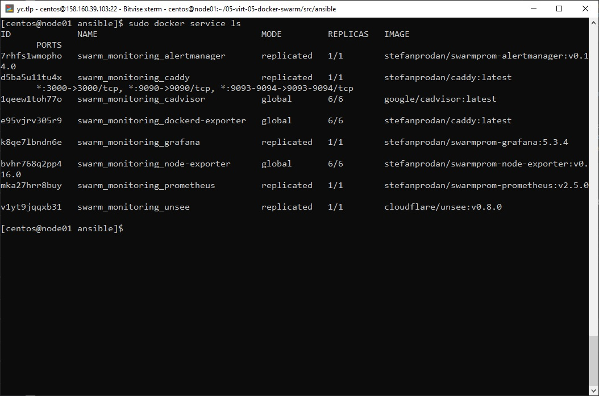

## Задача 1

Дайте письменые ответы на следующие вопросы:

- В чём отличие режимов работы сервисов в Docker Swarm кластере: replication и global?
- Какой алгоритм выбора лидера используется в Docker Swarm кластере?
- Что такое Overlay Network?

```
- В случае, когда указан mode global, то сервис запустится не всех нодах, в случае с replication - только на тех нодах, на которых мы указали в конфиге.
- Алгоритм RAFT - алгоритм построен на распределенном консенсусе, то есть в единицу времени, как минимум две ноды участвуют, отправляют заявку на лидерство, тот кто первый ответил, то становится лидером. Дальше в работе ноды между собой посылают запросы, чтобы определить доступен ли лидер и отвечает ли он до сих пор самый первый, в случае, когда лидер не ответил в заданное время идет пересогласование по тому же принципу. попытался дать пояснения своими словами
- Overlay Network - распределенная сеть кластера, которая позволяет общаться контейнерам между собой на разных нодах, возможно шифрование трафика. docker engine в рамках такой сети, сам занимается маршрутизацией.
```

## Задача 2

Создать ваш первый Docker Swarm кластер в Яндекс.Облаке

Для получения зачета, вам необходимо предоставить скриншот из терминала (консоли), с выводом команды:
```
docker node ls
```


## Задача 3

Создать ваш первый, готовый к боевой эксплуатации кластер мониторинга, состоящий из стека микросервисов.

Для получения зачета, вам необходимо предоставить скриншот из терминала (консоли), с выводом команды:
```
docker service ls
```

