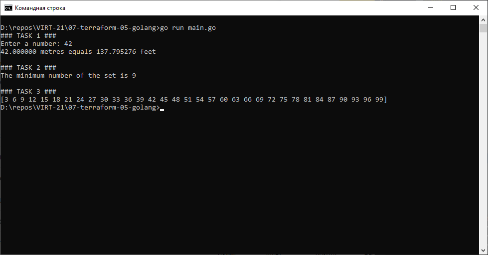

# Домашнее задание к занятию "7.5. Основы golang"

С `golang` в рамках курса, мы будем работать не много, поэтому можно использовать любой IDE.
Но рекомендуем ознакомиться с [GoLand](https://www.jetbrains.com/ru-ru/go/).

## Задача 1. Установите golang.
1. Воспользуйтесь инструкций с официального сайта: [https://golang.org/](https://golang.org/).
2. Так же для тестирования кода можно использовать песочницу: [https://play.golang.org/](https://play.golang.org/).

## Задача 2. Знакомство с gotour.
У Golang есть обучающая интерактивная консоль [https://tour.golang.org/](https://tour.golang.org/).
Рекомендуется изучить максимальное количество примеров. В консоли уже написан необходимый код,
осталось только с ним ознакомиться и поэкспериментировать как написано в инструкции в левой части экрана.

## Задача 3. Написание кода.
Цель этого задания закрепить знания о базовом синтаксисе языка. Можно использовать редактор кода
на своем компьютере, либо использовать песочницу: [https://play.golang.org/](https://play.golang.org/).

1. Напишите программу для перевода метров в футы (1 фут = 0.3048 метр). Можно запросить исходные данные
   у пользователя, а можно статически задать в коде.
   Для взаимодействия с пользователем можно использовать функцию `Scanf`:
    ```
    package main
    
    import "fmt"
    
    func main() {
        fmt.Print("Enter a number: ")
        var input float64
        fmt.Scanf("%f", &input)
    
        output := input * 2
    
        fmt.Println(output)    
    }
    ```

1. Напишите программу, которая найдет наименьший элемент в любом заданном списке, например:
    ```
    x := []int{48,96,86,68,57,82,63,70,37,34,83,27,19,97,9,17,}
    ```
1. Напишите программу, которая выводит числа от 1 до 100, которые делятся на 3. То есть `(3, 6, 9, …)`.

В виде решения ссылку на код или сам код. 

```go
package main

import (
    "fmt"
    "errors"
)

func metresToFeet(metres float64) float64 {
	const METRES_IN_FEET float64 = 0.3048
	return metres * METRES_IN_FEET
}

func intListMin(list []int) (int, error) {
    if (len(list) == 0) {
        return 0, errors.New("Empty list")
    }

    var min int = list[0]
    for _, value := range list {
        if (value < min) {
            min = value
        }
    }

    return min, nil
}

func printMultiplesOf3() []int {
    result := make([]int, 0);
    for i := 1; i <= 100; i++ {
		if (i % 3 == 0) {
			result = append(result, i)
		}
	}
	return result
}

func main() {
    fmt.Print("### TASK 1 ###\n")
	fmt.Print("Enter a number: ")
	var input float64
	_, err := fmt.Scanf("%f", &input)

	if (err != nil) {
	    fmt.Print("Incorrect input")
	} else {
	    fmt.Printf("%f metres equals %f feet", input, feetToMetres(input))
	}

    fmt.Print("\n\n### TASK 2 ###\n")
    var list = []int{48,96,86,68,57,82,63,70,37,34,83,27,19,97,9,17,}
    min, err := intListMin(list);

    if (err != nil) {
        fmt.Print(err)
    } else {
        fmt.Printf("The minimum number of the set is %d", min)
    }

    fmt.Print("\n\n### TASK 3 ###\n")
    fmt.Print(printMultiplesOf3())
}
```

